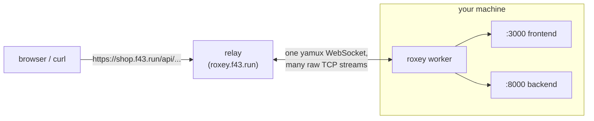

Roxey is a tunneling and local reverse-proxy tool for development teams. Point it at the services running on your machine — or let it start them for you — and they become reachable at clean, HTTPS URLs like `https://myapp.f43.run` or `https://api.localhost`, with path-based routing between multiple services on a single domain.

It is designed for the messy reality of modern local development: a frontend, a backend, a worker, maybe a second site — all needing to share one origin, one set of OAuth callbacks, and one URL scheme that matches production.

## Features

- **Named HTTPS URLs** — expose any local port as `https://<name>.<domain>`, no ports to remember
- **Path-based routing** — split one domain across multiple services (`/api/*` → backend, `/` → frontend), like an nginx ingress but without the config ceremony
- **Compose-style manifests** — describe your whole project topology in a single `roxey.yaml` with `roxey up` / `roxey down`
- **Service spawning** — roxey can run your dev commands itself (portless-style), inject `PORT`/`HOST`/custom env vars, wait for readiness, and clean up on Ctrl-C
- **Local relay mode** — run the relay backend on your own machine for instant `.localhost` HTTPS domains, complete with automatic CA generation and trust-store installation
- **Everything streams** — tunnels are raw TCP pipes, so WebSockets, SSE, HMR, and large uploads just work
- **Self-hostable** — use the hosted relay at `roxey.f43.run`, or deploy your own with a single Docker image
- **Boot-time daemon** — install the local relay as a system service that survives reboots, with per-project autostart

## Getting Started

### Installation

No install step via npx (macOS/Linux) — the binary is downloaded from GitHub Releases on first run and cached in `~/.roxey/bin`:

```bash
npx @four43labs/roxey --help
```

Or install globally:

```bash
npm install -g @four43labs/roxey
```

Or grab a prebuilt binary directly from the [releases page](https://github.com/four43labs/roxey/releases), or build from source:

```bash
git clone https://github.com/four43labs/roxey && cd roxey
cd cli && go build -o roxey . && mv roxey /usr/local/bin/
```

### Authenticating

1. [Create an account](https://roxey.f43.run/signup) on the relay dashboard
2. Sign in and click **[ generate new key ]**
3. Save it in the CLI:

```bash
roxey auth <api-key-from-dashboard>
# or paste interactively:
roxey auth
```

Keys are shown once at creation and stored per relay in `~/.roxey/config.json`. Working against multiple relays? Save one per TLD:

```bash
roxey auth --tld dev.mycompany.dev <key>
```

### Quick tunnel: expose one port

The fastest way to try Roxey — put a local dev server on a public URL:

```bash
roxey start myapp localhost:3000
# -> https://myapp-k3f9q2.f43.run  (host assigned by the relay)
```

On the hosted relay every tunnel gets its own unguessable hostname (`<service>-<suffix>`), so nobody can find or collide with your previews.

### Path routing: many services, one domain

Split a single hostname across services using `<service>/<path>/*` specs. The full request path is forwarded unchanged, so backends see exactly what production would send them:

```bash
roxey start myapp localhost:3000            # root of the subdomain
roxey start "myapp/api/*" localhost:8000    # /api/* -> backend
roxey list                                  # see what's running
roxey stop myapp                            # stops all routes for myapp
```

### Protecting previews

Tunnel URLs are unguessable, but anyone who gets one can use it. Add a shared secret and visitors must unlock the preview before any traffic reaches your app:

```bash
roxey start myapp localhost:3000 --protect swordfish
```

or in a manifest:

```yaml
environments:
  - host: app
    protect: swordfish   # visitors get a password prompt
    routes:
      "/": localhost:3000
```

The gate runs on the relay — your app never sees failed attempts. Browsers get an unlock page (cookie keeps them signed in); scripts can pass `?access_token=swordfish` or HTTP Basic auth (`curl -u x:swordfish`).

### Project topology: `roxey.yaml` and `up`/`down`

For multi-service projects, declare everything in a manifest instead of running ad-hoc commands. Routes either proxy to a running address or let roxey spawn the service itself:

```yaml
relay_server:
  tld: f43.run              # remote relay at roxey.f43.run
  # api_key: rxy_...        # optional; falls back to saved auth state
  # local: true             # or run the relay locally (see below)

environments:
  - host: shop              # -> https://shop.f43.run
    routes:
      "/": website:3001     # proxy to a running address...
      "/api": localhost:8000
      "/storefront":        # ...or have roxey spawn the command itself
        command: npm run dev
        cwd: apps/web       # optional; default is the manifest's directory
        port: 3000          # required for spawned services (exported as PORT)
        environment:        # extra env vars for the child process
          NODE_ENV: development
```

```bash
roxey up      # foreground: interleaved [name] logs, Ctrl-C tears down everything
roxey up -d   # detached: prints a URL table, logs via `roxey logs <name>`
roxey up --online                 # temporarily use ROXEY_DOMAIN or f43.run
roxey up --online --protect pass  # one unlock grants access to every host
roxey down    # stop this manifest's tunnels and spawned services
```

Spawned services receive `PORT`, `HOST=127.0.0.1`, and their `environment`
map. `up` waits until each port accepts connections before opening its
tunnel, and re-running it restarts the manifest's services and tunnels from
a clean slate — a crashed run can never leave orphans behind.

`--online` overrides the manifest relay for that run with the hosted relay
(`ROXEY_DOMAIN`, default `f43.run`) without creating or changing a manifest.
If a local manifest uses dotted hosts such as `app.verifycate`, Roxey
automatically applies a stable checkout preview slug so the hosted service
names remain valid single DNS labels. `--protect <secret>` (or
`--protect=<secret>`) overrides protection on every environment; all hosts in
that `up` share one unlock gate. Ad-hoc `roxey start --protect` remains scoped
to that one host.

### Local development domains: `local` relay mode

Skip the hosted relay entirely and run one on your own machine — portless-style local domains with real HTTPS:

```yaml
relay_server:
  local: true           # tld defaults to "dev"...
  # tld: mycompany.dev  # ...but ANY domain works
```

On first `up`, roxey downloads the relay binary, generates a local CA, asks once for sudo to trust it and bind port 443, creates its own API key, and starts the relay. Host-file synchronization is idempotent, so unchanged hosts do not prompt for sudo again. You then browse your project's URLs with no cert warnings and no manual setup.

**One relay serves all your projects.** The default TLD is `dev`, and every project namespaces its hosts under its own name:

```yaml
# netflix/roxey.yaml
environments:
  - host: app.netflix
    ...
  - host: api.netflix
```

→ `https://app.netflix.dev` and `https://api.netflix.dev` run against the same `roxey.dev` as any other project you `up` (each claims its own namespace, like `*.stripe` or `*.linear`). Certificates and `/etc/hosts` entries are cumulative across projects; `down` removes only that project's names.

Any explicit `tld:` is still honored (`tld: localhost` for native-resolving names, or a production-shaped domain like `dev.mycompany.dev`).

#### When to use which

- **`local: true` (default `.dev`)** — everyday work. All projects share one relay; hosts are synced into `/etc/hosts` under a managed block.
- **Hosted / self-hosted remote relay** — when teammates, LAN devices, or external webhooks must reach your dev environment.

#### Tips for local dev

- OAuth callbacks work as-is under a custom TLD: register the callback URL once and it works across every branch.
- Give each service its own host (`api.*`, `admin.*`) rather than path prefixes when apps hard-code origins or cookies.
- The relay keeps running after `roxey down` so subsequent `up`s are instant; stop it manually with `pkill roxey-relay` — or install it as a boot daemon (below).

### Boot-time service (Docker Desktop-style)

Keep the local relay alive across reboots, and optionally bring projects up at login:

```bash
roxey service install                  # relay daemon: starts at boot, restarts on crash
roxey projects --autostart netflix  # also bring this project up at login
roxey projects --autostart-off netflix
roxey service status                   # daemon state + autostart list
roxey service uninstall                # remove everything
```

macOS uses a root LaunchDaemon (`KeepAlive`) plus per-project user LaunchAgents; Linux uses systemd system/user units. The daemon replays the same commands you would run by hand — nothing about your manifests changes.

### Multiple projects from anywhere

The first `roxey up` in a project registers it in `~/.roxey/projects.json`. After that, every command works from any directory:

```bash
roxey projects                    # all known projects + live status
roxey up --project netflix     # bring up from anywhere
roxey down --project netflix   # tear down just that project
roxey logs <service-name>         # tail a detached service
roxey doctor --project netflix # diagnose one project
roxey projects --forget netflix  # drop a project from the registry
roxey projects --prune            # GC projects whose directories are gone
```

Status is always derived live — the registry stores only identity (name, path, claimed hosts), never state that can go stale.

### Fork previews for git worktrees (AI-agent friendly)

Run `roxey up` inside a linked git worktree and roxey automatically creates an *isolated preview*: environment hosts get the branch slug as prefix, every spawned route gets a distinct fresh port, localhost proxy aliases are remapped with it, and everything registers as its own project. Detached worktrees include a stable path discriminator, so two worktrees at the same commit still get different preview names.

```bash
cd ~/projects/netflix.worktrees/fix-13-auth   # a git worktree
roxey up                                          # → https://fix-13-app-netflix.dev
                                                  # → https://fix-13-api-netflix.dev

roxey projects                                    # main + preview listed side by side
roxey down                                        # tears down only this fork
```

You can also force a named preview from anywhere (e.g. by commit id): `roxey up --preview=abc1234`.

To keep forks pointing at *their own* services instead of the main checkout's, reference sibling hosts with templates in route env vars:

```yaml
environment:
  NEXT_PUBLIC_API_URL: https://{{host:api.netflix}}/api/v1
  API_PORT: "{{port:api.netflix}}"
  ONLINE: "{{online}}"
  # → resolves to https://fix-13-api-netflix.dev/api/v1 in the fork,
  #   https://api.netflix.dev on the main checkout — same yaml file everywhere
```

`{{port:host}}` resolves to that declared host's spawned `/` route after
preview port allocation. `{{online}}` is `1` under `--online` and empty
otherwise. On hosted relays, `{{host:host}}` uses the relay's actual assigned
hostname, including its account suffix.

Note: stateful dependencies stay shared — a preview talks to the same Postgres unless you give it its own.
Everything binds to loopback only — nothing is reachable from other machines unless you also point a remote relay at them.

## Commands

```
roxey auth [--tld <tld>] [api-key]
  # Save an API key for a relay server (prompts if key omitted)

roxey up [-d] [--preview[=slug]] [--online] [--protect <secret>] [--project <name>] [file]
  # Bring up every environment in a roxey.yaml manifest
  #   -d, --detach     Run detached; print URL table instead of streaming logs
  #   --preview[=slug] Force fork-preview mode (auto-detected in git worktrees)
  #   --online         Use ROXEY_DOMAIN or f43.run instead of the manifest relay
  #   --protect secret Protect every environment with one shared unlock gate
  #   --project <name> Run a registered project from any directory
  #   file             Manifest path; defaults to ./roxey.yaml

roxey down [--project <name>] [file]
  # Stop the tunnels and spawned services owned by a manifest

roxey projects [--forget <name>] [--prune]
  # List known projects with live status; forget/GC registry entries

roxey logs <name>
  # Tail the log of a service started with `up -d`

roxey doctor [--project <name>] [roxey.yaml]
  # Diagnose state, relays, certs, and ports; exit 1 on any failure

roxey start <service>[/path/*] <target>
  # Start an ad-hoc tunnel, e.g. roxey start myapp localhost:3000

roxey stop <service>[/path]
  # Stop a running tunnel (bare service name stops all of its routes)

roxey list
  # List live tunnels and spawned services on this machine

roxey service install|uninstall|status
  # Manage the boot-time relay daemon (launchd/systemd); status shows
  # daemon state and which projects have autostart enabled
```

Environment variables:

| Variable | Purpose |
|---|---|
| `ROXEY_DOMAIN` | Default TLD when no manifest/flag specifies one (default: `f43.run`) |
| `ROXEY_RELAY_HOST` | Override the relay hostname (`roxey.<tld>` by default) |
| `ROXEY_INSECURE=1` | Connect tunnels over plain `ws://` (testing relays without TLS) |
| `ROXEY_RELAY_BIN` | Use a local relay binary instead of downloading one |

## How It Works

Roxey has two halves: a **relay** that answers public requests, and a **CLI** that connects your machine to it.



1. `roxey start` (or `up`) spawns a background worker that opens a single WebSocket to the relay at `wss://roxey.<tld>/_ws`, authenticated with your API key.
2. The relay registers that connection under the requested service name (and path prefix, if any).
3. A public request to `https://<service>.<tld>/...` is streamed over a fresh raw TCP stream, multiplexed through the CLI's WebSocket with yamux. The CLI dials the local target's port and pipes bytes in both directions until either side closes.
4. When the worker disconnects (`roxey stop`, Ctrl-C, network loss), the relay deregisters the route immediately.

Because each connection is an opaque byte pipe, anything spoken over HTTP passes through untouched — WebSocket upgrades (Vite/Next HMR), SSE, chunked uploads, and large downloads all stream without buffering. Routing decisions happen only at the edge: subdomain selects the environment, longest-matching registered path prefix selects the backend.

In `local` mode the same architecture runs entirely on your machine: the relay binds `127.0.0.1:443` behind a locally-generated wildcard certificate, so nothing leaves your network.

## Project Modules

The repository is two independent Go modules plus an npm wrapper:

- **`backend/`** — the relay. A single HTTP server that terminates traffic for `*.<domain>`, resolves each request against an in-memory routing table, and pipes connections as raw TCP streams over multiplexed WebSockets. Also serves an account dashboard (signup/login, API keys, live tunnel status, protected previews), backed by SQLite. Ships as a Docker image and prebuilt binaries.
- **`cli/`** — the `roxey` binary users install. Handles authentication, manifest loading/validation, spawning and supervising services, and running the background tunnel workers. This is what npm distributes as `@four43labs/roxey`.
- **`npm/`** — a thin installer package; downloads the matching platform binary from GitHub Releases on first run.

## Choosing the Relay Backend

By default the CLI talks to the relay operated by Four43 Labs at `roxey.f43.run` — no setup beyond `roxey auth`. You have three options, selected per project in the manifest's `relay_server` block:

1. **Hosted relay** (default) — `tld: f43.run`; public HTTPS URLs out of the box.
2. **Local relay** (`local: true`) — the relay runs on your machine; see [Local development domains](#local-development-domains-local-relay-mode). Best for solo dev with production-shaped URLs and nothing exposed externally.
3. **Self-hosted remote relay** — your own deployment of the image below, for teams that need private infrastructure or a custom domain.

### Deploying Your Own Relay Backend

Point a wildcard DNS record (`*.your-domain.com`) at your server — through Cloudflare or any proxy that terminates TLS — then run the image:

```bash
docker run -d -p 8080:8080 \
  -e ROXEY_DOMAIN=your-domain.com \
  -e ROXEY_SESSION_SECRET=$(openssl rand -hex 32) \
  -v roxey-data:/data \
  ghcr.io/four43labs/roxey-relay:latest
```

The relay writes its SQLite database to `/data/roxey.db` (`ROXEY_DB_PATH`); mount the volume so accounts and API keys survive restarts. Visitors sign up at `https://roxey.your-domain.com`, generate keys, and authenticate clients with `ROXEY_DOMAIN=your-domain.com roxey auth <key>`.

Running it just for yourself? Skip open signup entirely with single-user mode:

```bash
docker run -d -p 8080:8080 \
  -e ROXEY_DOMAIN=your-domain.com \
  -e ROXEY_SINGLE_USER=1 \
  -e ROXEY_ADMIN_EMAIL=me@example.com \
  -e ROXEY_ADMIN_PASSWORD=change-me \
  -e ROXEY_SESSION_SECRET=$(openssl rand -hex 32) \
  -v roxey-data:/data \
  ghcr.io/four43labs/roxey-relay:latest
```

Single-user mode seeds one account (idempotently — env wins on restart) and serves tunnels on bare `<service>.<tld>` hostnames instead of namespaced ones.

Additional server options:

| Variable | Default | Purpose |
|---|---|---|
| `PORT` | `8080` | Listen port |
| `ROXEY_ADMIN_HOST` | `roxey.<domain>` | Host serving the dashboard/API |
| `ROXEY_DB_PATH` | `roxey.db` | SQLite location |
| `ROXEY_SESSION_SECRET` | generated & persisted | HMAC key for session/gate cookies |
| `ROXEY_SINGLE_USER` | unset | `1` disables signup, seeds one account, bare hosts |
| `ROXEY_ADMIN_EMAIL` / `ROXEY_ADMIN_PASSWORD` | — | Account credentials in single-user mode |
| `ROXEY_TLS_CERT` / `ROXEY_TLS_KEY` | unset | Serve HTTPS directly (otherwise terminate TLS upstream) |

> Upgrading from a pre-accounts relay? Databases cannot be migrated — delete `roxey.db` and re-create your keys.

Releases are tagged `vX.Y.Z`; a single tag publishes the Docker image, both binaries, and the npm package together.

## Comparison

| | Roxey | ngrok | Portless | Custom nginx |
|---|---|---|---|---|
| Named HTTPS URLs | ✅ | ✅ | ✅ `.localhost` | Manual |
| Shareable public URLs | ✅ | ✅ | ❌ (local/LAN only) | If publicly hosted |
| Path routing on one domain | ✅ | Paid plans | ❌ | ✅ |
| Declarative multi-service manifests | ✅ | ❌ | Partial | Hand-written configs |
| Starts your dev commands | ✅ | ❌ | ✅ | ❌ |
| Local-only mode (no cloud) | ✅ | ❌ | ✅ | ✅ |
| Self-hosted relay | ✅ single image | Enterprise | n/a | n/a |
| Setup effort | One command | One command | One command | Significant |

## Requirements

- macOS or Linux (Windows builds are not published yet)
- Node.js ≥ 18 for the npm installer, or use a prebuilt binary
- Go ≥ 1.24 only if building from source
- For local relay mode: sudo access (first run only, to trust the CA and bind port 443)

## License

This project and library is MIT licensed. See [`LICENSE`](LICENSE) for details.
